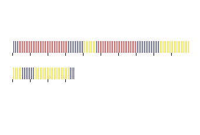
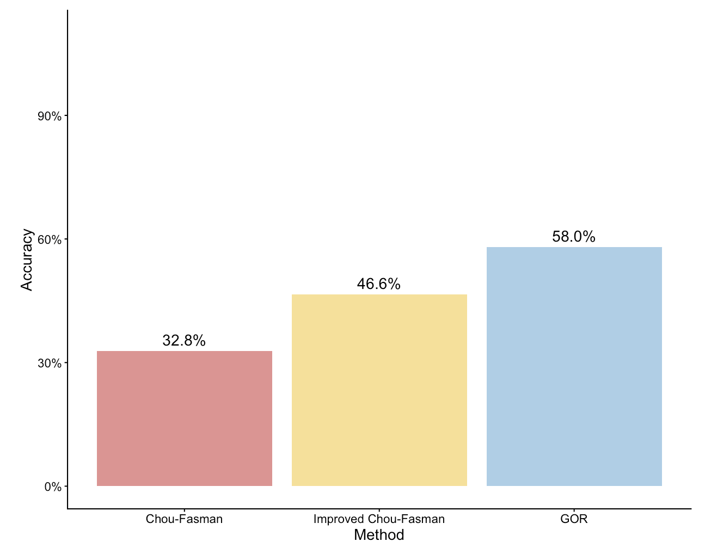
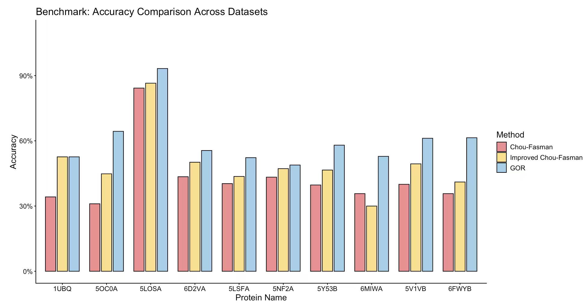

# Protein Secondary Structure Prediction: Chou–Fasman, Improved Chou–Fasman, and GOR

## 1. Project Description
This project implements three classical algorithms for protein secondary structure prediction:

- **Chou–Fasman**
A rule-based algorithm that uses predefined amino acid conformation propensities to identify helix, sheet, and coil segments via nucleation and extension rules.

- **Improved Chou–Fasman**
An updated version incorporating refined propensity values and more sophisticated segment detection thresholds to detect secondary structure.

- **GOR (Garnier–Osguthorpe–Robson)**
An information-theoretic method that evaluates the central residue and its surrounding residues to compute conditional probabilities for helix, sheet, and coil states.

All algorithms were implemented in **Go (Golang)**, and an **R Shiny** web application was developed to provide an interactive interface for sequence input, prediction execution, and visualization.

---

## 2. Folder Structure
```
project/
├── chou_fasman/
│   ├── Data/
│   │   ├── input_sequence.txt
│   ├── Tests/
│   ├── main.go
│   ├── datatype.go
│   ├── functions.go
│   ├── functions_test.go
│   ├── drawing.go
├── improved_chou_fasman/
│   ├── Tests/
│   ├── main.go
│   ├── data.go
│   ├── functions.go
│   ├── functions_test.go
│   ├── drawing.go
├── GOR/
│   ├── data/
│   │   ├── blindTest
│   │   ├── training
│   ├── test/
│   ├── train/
│   │   ├── main.go
│   ├── predict/
│   │   ├── drawing.go
│   │   ├── main.go
│   ├── Tests/
│   ├── gor.go
│   ├── functions_test.go
├── data/
├── app.R
└── README.md
```

> **Note:** The `Tests` folder for each algorithm contains testing data for subroutines.

---

## 3. Requirements

### Go Backend
- Go **version 1.24.5**
- Additional Go packages:
    - **Canvas** (package for drawing)
    Download from:
    https://programmingforlovers.com/wp-content/uploads/canvas.zip

### R Shiny Frontend
Install the following R packages:

```r
install.packages(c(
  "shiny",
  "shinyjs",
  "tidyverse"
  "ggplot"
))
```

## 4. Running GO code
### Chou-Fasman
Open `~/chou_fasman/main.go', change the file path to the path of `.txt` file containing the sequence you want to predict. Then simply run `./chou_fasman` to get the prediction result and the "barcode" image.
```go
cd chou_fasman
go test
./chou_fasman
```

### Improved Chou–Fasman
Open ./improved_chou_fasman, simply run `./chou_fasman "path/to/your/file"` to get the prediction result and the image.
```go
cd improved_chou_fasman
go test
./improved_chou_fasman "path/to/your/file"
```

### GOR
First train the GOR model and save as .json file. Or you skip this step and simply use the model we've already trained by data in '~/GOR/data/training/list.txt`.
```go
// Training the algorithm
cd GOR
go run train/main.go -ids data/training/list.txt -pssm_dir data/training/pssm -dssp_dir data/training/dssp -out gor_model.json
```

For prediction, you can choose `-pssm', '-fasta', or '-seq'. For `-pssm' and '-fasta', upload the `.pssm` or `.fasta` file. For `-seq`, type the sequence to predict in the command line. 
```go
// Prediction (PSSM input)
go run ./predict \
  -model gor_model.json \
  -pssm "data/blindTest/pssm/6B8B:A.pssm"

// Prediction (Raw Sequence Input)
go run ./predict \
  -model gor_model.json \
  -seq "GSPRTVEEIFKDYSARRAALLRALTKDVDDFYSQCDPEKENLCLYGHPNESWEVNLPAEEVPPELPEPALGINFARDGMQRKDWLSLVAVHSDCWLLSVSFYFGARLNRNERKRLFSLINDLPTLFDVVTGRKAM"
```

## 5. RShiny
Open `~/app.R` in RStudio, click `Run App`.

Then upload .txt file as input.
Supported Input Types:
1. Amino acid sequence (1 line)
Available to use mode 1-3, displaying predicted structure for three algorithms.

2. Sequence + experimental structure (2 line)
Available to use mode 1-5, displaying predicted structure and accuracy based on experimental structure for three algorithms.

3. Multiple entries: name + sequence + structure
Available to use mode 5, performing benchmarking comparison across multiple proteins.

## 6. Example for Results
### 1. Predicted secondary structure
<div align="center">
  
  <p style="font-size: 0.9em; color: #555;">Figure 1: Predicted secondary structure of 5Y53B</p>
</div>

### 2. Accuracy of the three prediction methods for one protein
<div align="center">
  
  <p style="font-size: 0.9em; color: #555;">Figure 2: Accuracy comparison of Chou–Fasman, Improved Chou–Fasman, and GOR for 5Y53B</p>
</div>

### 3. Accuracy of the three prediction methods across multiple proteins
<div align="center">
  
  <p style="font-size: 0.9em; color: #555;">Figure 3: Accuracy comparison of the three methods across multiple proteins</p>
</div>


## 7. Notes
- Each algorithm has its own GO modules and tests
- Drawing functions require the Canvas package
- GOR requires running training step before prediction unless the trained parameters already exist.

## 8. Authors
This project was developed by:
- Bonnie Lai
- Kate Zhang
- Sorro Sun
- Yu-Lun Chen

## 9. Disclaimer
This README and the essay has been revised for formatting and language clarity with AI assistance. Portions of the testing functions in `functions_test.go`, the test data, and most comments were generated using AI tools.
